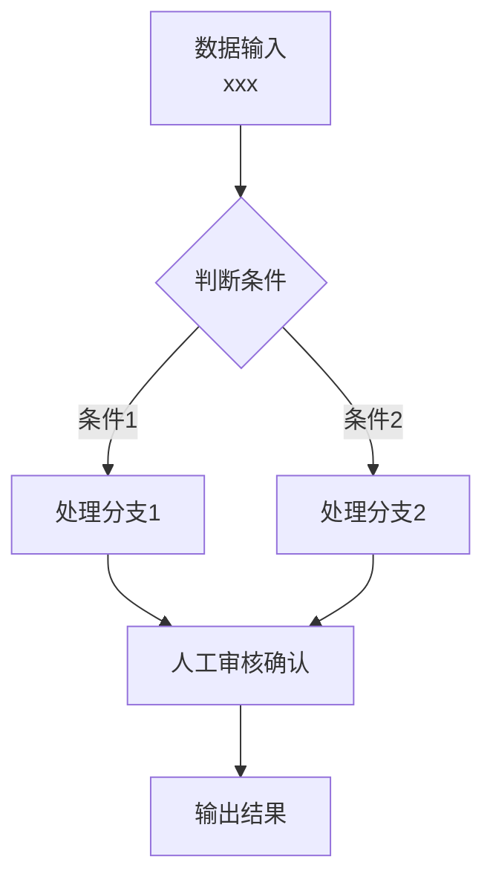
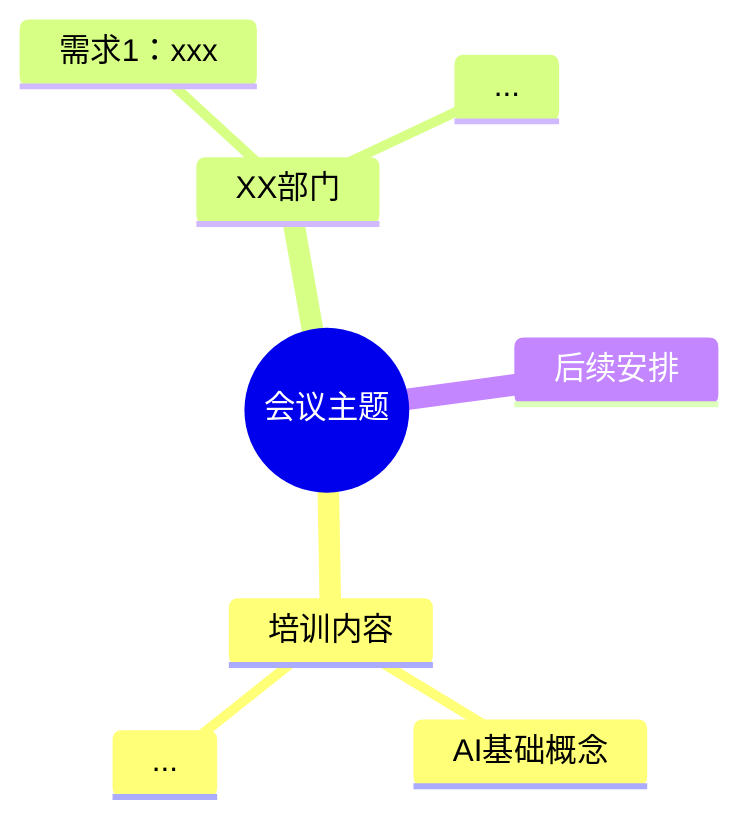

# Meeting Minutes Generator

Generate structured, professional meeting minutes from transcripts. Optimized for **platform training + requirements collection** meetings. Use this skill to produce consistent, actionable meeting documentation.

## Iron Law: Complete Coverage

**无论转录文本有多长，都必须完整处理全部内容，严禁遗漏任何部分。**

This is non-negotiable:

- If the transcript is too long for a single response, process it in **multiple passes** — chunk by time range, process each chunk independently, then merge
- If output is truncated, continue from exactly where you stopped — do not summarize or skip remaining content
- Every timestamped segment must be accounted for in the output. If a section of the transcript is deemed "not relevant to the main topic", include it anyway as a brief note rather than dropping it entirely
- The 9-section structure must cover ALL content from the transcript, not just the "important parts"

**Violation detection**: If the chapter count or department count in your output does not match the transcript, you have violated this rule. Go back and fill in the missing parts.

**No exceptions:**
- Not for "this part is repetitive"
- Not for "this was already covered"
- Not for "context is limited"
- Process everything. Split into multiple responses if needed.

## Input Handling

Transcripts may have **timestamps only (no speaker labels)**. Infer speaker roles from semantics:
- Explaining AI concepts, platform features, demos → **Trainer (培训方)**
- Describing workflows, pain points, saying "我们的痛点"/"我们希望" → **Client department (客户部门)**
- Clients usually announce their department first ("我是XX部门的") — anchor subsequent content to that department

## Output Structure

Output complete Markdown following these 9 sections. Skip sections that have no content.

### Section 1: 会议概览

| 项目 | 内容 |
|------|------|
| 会议时间 | ... |
| 会议地点 | ... |
| 培训方 |  names |
| 客户方参会部门 | list all |
| 会议主题 | 企业需求采集调研 |
| 会议时长 | ... |

### Section 2: 培训内容记录

Sub-sections:
- **2.1 基础概念** — concepts, analogies used, client questions
- **2.2 平台架构** —
- **2.3 平台场景演示** — each demo scenario with workflow and pain point it solves
- **2.4 客户答疑与讨论要点** — non-requirement Q&A

### Section 3: 需求采集（按部门）

**THIS IS THE CORE SECTION.** One subsection per department. For each requirement within a department:

**Department overview table:**

| 序号 | 需求名称 | 痛点一句话 | 紧急程度 |
|------|----------|-----------|----------|
| 1 | ... | ... | ⭐⭐⭐ / ⭐⭐ / ⭐ |

**Per-requirement deep dive (6 dimensions):**

**(1) 痛点描述** — What's the pain? Repetitive work, efficiency bottleneck?

**(2) 当前人工操作步骤** — Break down the manual process step by step:
> 步骤1: ...
> 步骤2: ...
> Don't omit any detail the client mentioned.

**(3) 涉及的数据源**

| 数据项 | 来源系统 | 获取方式 | 备注 |
|--------|---------|---------|------|
| ... | ... | API / 数据库直连 / Excel | ... |

**(4) 判断/决策逻辑** — Human judgment rules:
- 判定条件1: if ... then ...
- 判定条件2: if ... then ...

**(5) 客户预期结果** — What output/effect the client expects.

**(6) 需求流转流程图** — Mermaid flowchart for this requirement:
- Use letter+digit node IDs (A, B1, C2), never pure numbers
- Use Chinese punctuation in node text, ` ` for line breaks
- Must include: data input → decision branches → branch outcomes → output → human review gate

Mark urgent requirements with: ⚠️ **【优先实现需求】**

### Section 4: 数据源与系统对接汇总

| 序号 | 系统/数据源名称 | 涉及部门 | 对接方式 | 是否已有API | 是否需要测试账号 | 备注 |
|------|---------------|---------|---------|------------|----------------|------|
| 1 | ... | ... | ... | ... | ... | ... |

### Section 5: 跨部门协同关系图

Mermaid flowchart showing cross-department data flow and dependencies.

### Section 6: 思维导图

Mermaid mindmap of the entire meeting structure. Rules:
- Use Chinese colon (：) not half-width colon (:) in node text
- Use ` ` for line breaks within nodes

### Section 7: 会议整体流程图

Mermaid flowchart: 开场 → 演示 → 培训 → 答疑 → 需求采集 → 优先级讨论 → 后续安排

### Section 8: 待办事项

Split by responsibility:

| 序号 | 任务 | 责任方 | 负责人/部门 | 紧急程度 | 依赖/前置条件 |
|------|------|--------|------------|---------|--------------|
| 1 | ... | 客户方/培训方 | ... | 高/中/低 | ... |

### Section 9: 下次培训/沟通计划

Time, participants, core agenda, pre-requisites.

## Urgency Levels

- ⭐⭐⭐ **非常迫切**: Client says "最迫切", "花时间最多", "最烦", or management explicitly prioritizes
- ⭐⭐ **较迫切**: Clear pain point but not flagged as top priority
- ⭐ **一般**: Nice-to-have improvement

## Mermaid Compatibility

- Node IDs: letter+digit only (A, B1, C2) — never pure numbers
- Node text: use Chinese punctuation, ` ` for line breaks
- Mindmap nodes: Chinese colon (：) not half-width (:)

## Anti-Patterns

- **Don't skip or summarize any portion of the transcript** — this is the #1 rule. Long transcripts must be processed in multiple passes if needed
- Don't write "以下是会议纪要" preamble — output directly
- Don't omit client's operational details — preserve every workflow step the client described
- Don't skip departments or merge them together — each department that spoke gets its own section
- Don't use generic flowcharts — reflect actual business logic with decision branches
- Don't use half-width colons in Mermaid mindmap nodes
- Don't drop "minor" requirements — even brief mentions of pain points should be recorded
- Don't truncate output mid-section — if output is cut off, continue in the next response from the exact break point
